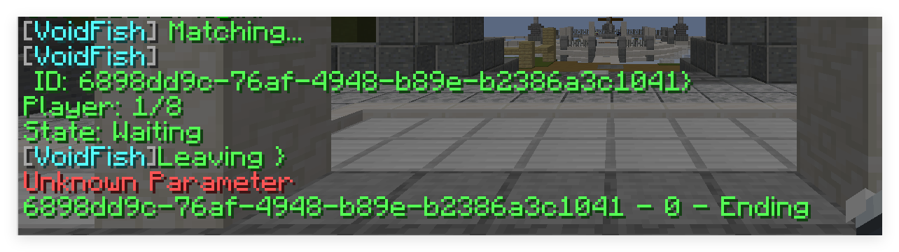
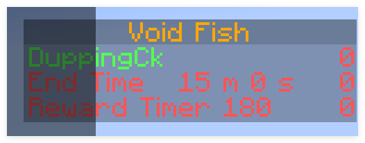
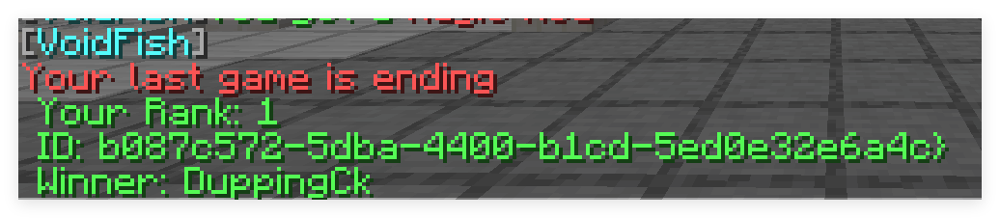

# VoidFish - Spigot

## Description
A Spigot Plugin Sky Wars where you get any item by fishing

Each player has a bedrock-built platform to fish their way to victory!

## Depend
Multiverse-Core

PlaceholderAPI (Soft)

## Permissions
- `voidfish.game` - Permission to game

## Commands
- `/vfg` - Main command
- `/vfg match` - Start a match
- `/vfg leave` - Leave a match
- `/vfg start` - Start a match (Need permission)

## Config
- config.yml - Main configuration file
- messages.yml - Messages configuration file
- stat.yml - statistics store file

## Gaming Picture

